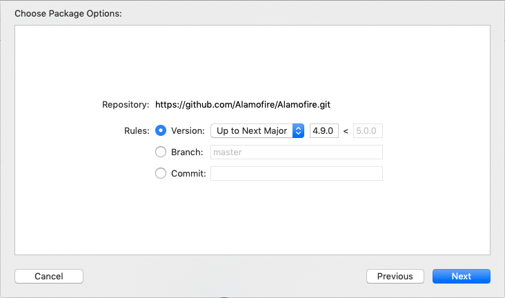
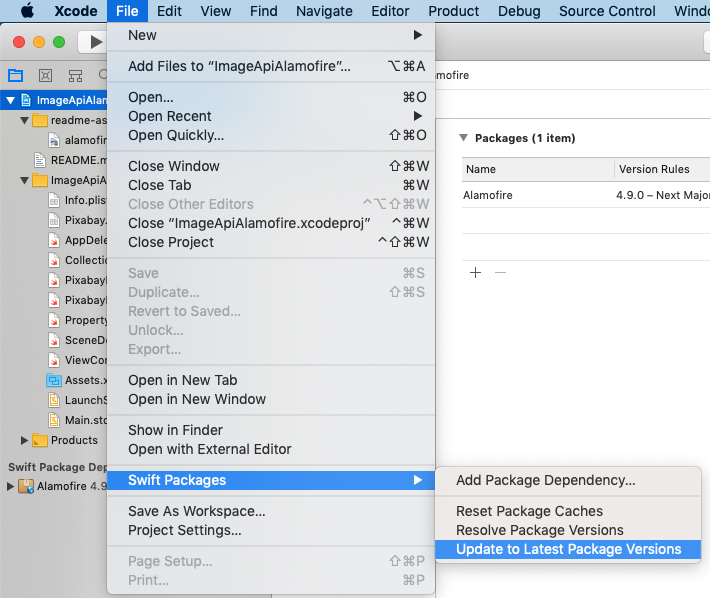

#  ImageApiAlamofire
## Alamofire Pixabay Image API Demo with Swift Package Manager
**Tested with Xcode 11 Beta 7, iOS 13.0 and Alamofire 4.9.0**


This demo uses Alamofire to make HTTP GET requests to the Pixabay REST API for image data.
The Swift Package Manager is used to add Alamofire to the project.

## Adding Alamofire to the project using Swift Package Manager
The Swift Package Manager (https://swift.org/package-manager/) is included with Xcode 11 and 
can be used to automatically add dependencies (**Package Dependencies**, "package" hereafter) 
to a project. 

There are other package managers available (e.g. CocoaPods and Carthage) that we've had to
reply on until recently. However, now that Swift package manager is available for use with iOS projects
I suspect it will eventually become the the standard way of distributing and managing dependencies
in projects.

Adding a package to an existing Xcode project is simple. 
Select **File > Swift Packages > Add Package Dependency...**:


If you know the URL of the package repository (e.g. on GitHub) then use that:


If you only know the name of the package, try searching for that. Here I’m searching for “alamofire”:


Now you need to select the correct owner of the package. If you select a package Xcode will display 
additional info. If you click on the README link for the package that should give you a good indication of 
the owner:


Once you’ve selected a package Xcode will show you the URL of the repository and allow you to pick 
the version. You can also select from a particular source branch if you need to:



Once you click Next Xcode will download the package source and add the dependency to your project:


You can update the package to the latest version at any point by selecting 
**File > Swift Packages > Update to Latest Package Versions**:



___

## Getting an API Key from Pixabay
The free Pixabay REST API allows us to seach for images. The response is a JSON encoded list of image links and metadata.
Now we can use Alamofire to create a simple iOS app that requests image data from Pixabay (https://pixabay.com) using its free API.

First, register for an account at https://pixabay.com/en/accounts/register/


Once you login to your account on Pixabay you’ll be able to see your API key in https://pixabay.com/api/docs/:


Queries are very simple. The main parameters are:

**key** - Your API key
**q** - What you’re searching for (URL encoded)
**image_type** - The type of image you want ("all", "photo", "illustration", "vector")

For example, we can look for “coffee” photos (the q parameter must be URL encoded) with:

https://pixabay.com/api/?key=your-api-key&q=coffee&image_type=photo

Note that there are also **page** and **per_page** parameters which we can use to implement lazily-loaded paginated data:


We can test the query in an HTTP client such as Paw (https://paw.cloud/) or just in a browser:


Useful values returned in the response include:

**totalHits**
The number of images accessible through the API. By default, the API is limited to return a maximum of 500 images per query.

**hits**
A collection of image metadata, including URLs for a preview image, large image, etc.

___

## Project Design
Create a new project in Xcode named ImageApiAlamofire:


The overall design for the app is as follows:


* A struct named **PixabayData**
    * Implements the **Decodable** protocol
    * Used as the model to map incoming raw JSON data from the Pixabay web API
    * The **hits** member of the struct will hold an array of image metadata (**PixabayImage**)

``` swift
public struct PixabayData: Decodable {
    var totalHits: Int
    var hits: [PixabayImage]
    var total: Int
}
```

* A struct named **PixabayImage**
    * Implements the **Decodable** protocol
    * Models all the data for an individual Pixabay image
* A class named **PixabayHelper**
    * Provides a **loadImage(searchFor:completion:)** method
    * Makes HTTP GET requests using **Alamofire**
    * Decodes the incoming JSON data
    * When data has been loaded calls the completion closure passed to loadImage(searchFor:completion:) with data
* Main **ViewController** class
    * Will show a collection of preview images using a **UICollectionView**
    
* Store static query string elements in a .plist file and use a class **PropertyFileHelper** to help retrieve values
* The user can enter a search term for the images to be retrieved

___

## Implementation
First, the default security configuration for iOS will not allow requests to random URLs. 
You need to explicitly configure access to Pixabay by adding the following to your Info.plist:

``` XML
<key>NSAppTransportSecurity</key>
<dict>
    <key>NSExceptionDomains</key>
    <dict>
        <key>pixabay.com</key>
        <dict>
            <key>NSExceptionAllowsInsecureHTTPLoads</key>
            <true/>
        </dict>
    </dict>
</dict>
```


Create a new .plist file named **Pixabay.plist**. 
Open it as source code and add the following:

``` XML
<?xml version="1.0" encoding="UTF-8"?>
<!DOCTYPE plist PUBLIC "-//Apple//DTD PLIST 1.0//EN" "http://www.apple.com/DTDs/PropertyList-1.0.dtd">
<plist version="1.0">
<dict>
    <key>url</key>
    <string>https://pixabay.com/api/</string>
    <key>key</key>
    <string>your-key</string>
    <key>image_type</key>
    <string>photo</string>
    <key>per_page</key>
    <string>10</string>
</dict>
</plist>
```

Create a new .swift file named **PropertyFileHelper.swift** and add the following:

``` swift
/*
 
 PropertyFileHelper reads the contents of a .plist file and allows you to read individual
 properties by their keys.
 
 Example usage:
 
 let _plistHelper = PropertyFileHelper(file: "MyPlistFile")  // Note: No .plist file extn
 guard _plistHelper.hasLoadedProperties else { return }
 guard var myValue = _plistHelper.readProperty(key: "MyKey") else { return }
 
 */

import UIKit

public class PropertyFileHelper {
    fileprivate var _propertyFile: [String : AnyObject]?
    public var hasLoadedProperties: Bool { return _propertyFile != nil ? true : false }
   
    init(file: String) {
        _propertyFile = readPropertyFile(filename: file)
    }
   
    /// Read a property from a dictionary of values that was read from a plist
    public func readProperty(key: String) -> String? {
        guard _propertyFile != nil else { return nil }
        if let value = _propertyFile![key] as? String {
            return value
        }
       
        return nil
    }
   
    /// Read a plist property file and return a dictionary of values
    public func readPropertyFile(filename: String) -> [String : AnyObject]? {
        if let path = Bundle.main.path(forResource: filename, ofType: "plist") {
            if let contents = NSDictionary(contentsOfFile: path) as? [String : AnyObject] {
                return contents
            }
        }
       
        return nil  // [:]
    }
}
```

Now create the model structs by adding a new file named **PixabayData.swift**:

``` swift
import Foundation

public struct PixabayData: Decodable {
    var totalHits: Int
    var hits: [PixabayImage]
    var total: Int
}

public struct PixabayImage: Decodable {
    var largeImageURL: String
    var webformatHeight: Int
    var webformatWidth: Int
    var likes: Int
    var imageWidth: Int
    var id: Int
    var userId: Int
    var views: Int
    var comments: Int
    var pageURL: String
    var imageHeight: Int
    var webformatURL: String
    var type: String
    var previewHeight: Int
    var tags: String
    var downloads: Int
    var user: String
    var favorites: Int
    var imageSize: Int
    var previewWidth: Int
    var userImageURL: String
    var previewURL: String
   
    // Use coding keys to map "user_id" to "userId"
    // If you remap one JSON field you have to supply all the other unmapped fields too
    enum CodingKeys: String, CodingKey {
        case largeImageURL
        case webformatHeight
        case webformatWidth
        case likes
        case imageWidth
        case id
        case userId = "user_id"
        case views
        case comments
        case pageURL
        case imageHeight
        case webformatURL
        case type
        case previewHeight
        case tags
        case downloads
        case user
        case favorites
        case imageSize
        case previewWidth
        case userImageURL
        case previewURL
    }
}
```

Now add the **Alamofire** package to the project using the Swift Package Manager technique described earlier.

Create a new helper class named **PixabayHelper** in a file named **PixabayHelper.swift**:

``` swift
//
//  PixabayHelper.swift
//  ImageApiAlamofire
//
//  Created by Russell Archer on 04/09/2019.
//  Copyright © 2019 Russell Archer. All rights reserved.
//

import Foundation
import UIKit
import Alamofire

/// Helper that uses Alamofire to perform an HTTP GET to request image data from Pixabay
class PixabayHelper: ObservableObject {
    fileprivate let plistHelper = PropertyFileHelper(file: "Pixabay")  // Allows us access to the Pixabay.plist config file
    fileprivate var currentSearchText = ""
    
    // Configuration data
    fileprivate var pixabayUrl: String
    fileprivate let pixabayApiKey: String
    fileprivate let pixabayImageType: String
    fileprivate let pixabayResultPerPage: String
    
    init() {
        // Read Pixabay parameters from a plist file
        pixabayUrl = plistHelper.readProperty(key: "url")!
        pixabayApiKey = plistHelper.readProperty(key: "key")!
        pixabayImageType = plistHelper.readProperty(key: "image_type")!
        pixabayResultPerPage = plistHelper.readProperty(key: "per_page")!
    }
    
    public func loadImages( searchFor: String, 
                            completion: @escaping (_ images: [PixabayImage]?) -> Void) {
        if searchFor == currentSearchText { return }
        currentSearchText = searchFor
        
        let params = ["key": pixabayApiKey, "image_type": pixabayImageType, "per_page": pixabayResultPerPage, "q": searchFor]
        
        // Make an HTPP GET request for image data
        Alamofire.request(pixabayUrl, method: .get, parameters: params)
        .validate(statusCode: 200..<300)  // Make sure we get a good HTTP 200 status code
        .validate(contentType: ["application/json"])  // Make sure the payload is JSON
        .responseJSON { response in
            guard response.result.isSuccess else { completion(nil); return }
            guard response.data != nil else { completion(nil); return }
            
            // Decode the JSON repsonse using iOS Foundation JSONDecoder
            let imageData = try? JSONDecoder().decode(PixabayData.self, from: response.data!)
            
            completion(imageData?.hits)  // Give the caller an array of image data
        }
    }
}
```

Notice the use of the **JSONDecoder** class. We can call its **decode()** method and supply the anticipated 
incoming model for the JSON by passing the Type for our PixabayData model:

``` swift
// Decode the JSON repsonse using iOS Foundation JSONDecoder
let imageData = try? JSONDecoder().decode(PixabayData.self, from: response.data!)
```

___

## The UI
Now let’s create the UI in Interface Builder.
Open the main Storyboard file and select the main **ViewController**.
Embed the ViewController in a **Navigation Controller** (this allows us to quickly add a search bar).
Drag a **UICollectionView** onto the **UIViewController**. 
Resize the collection view to fill the view controller.
Setup constraints for the collection view so it fills the entire view controller.
Now select the collection view cell and set its **reuse Identifier** to **imageCell**:


Add a small test image to the asset catalog.
Drag a **UIImageView** into the cell, set the test image as the Image and set the Content Mode to **Aspect Fit**:


Note that we don’t need to worry about sizing of the **UIImageView** just yet - we’ll do that after setting the size of the cell.

We now need to set an actual size for the cell. At runtime the collection view will fit as many cells (of the set size you’ve chosen) 
horizontally and vertically as it can, depending on device size and orientation.

Select the Collection View **Flow Layout**:


This shows the following in the **Size Inspector**. 
Set the Item Size to **200 x 200**:


Select the **UIImageView** again and setup constraints so that it fills the enclosing cell:


Create a new class named **CollectionViewCell** which derives from **UICollectionViewCell**:

``` swift
import UIKit
class CollectionViewCell: UICollectionViewCell {
}
```

Return to the Storyboard, select the collection view’s cell and set it’s **Custom Class** to **CollectionViewCell**:


With the cell still selected, open an Editor (Ctrl + Option + Cmd + Enter) and *Ctrl-drag* to create an outlet from the **UIImageView** to the 
**CollectionViewCell** class:


Now select the collection view itself and create a outlet to the main view controller:


Open **ViewController.swift** and add the following:

``` swift
//
//  ViewController.swift
//  ImageApiAlamofire
//
//  Created by Russell Archer on 04/09/2019.
//  Copyright © 2019 Russell Archer. All rights reserved.
//

import UIKit

class ViewController: UIViewController {
    @IBOutlet weak var imageCollectionView: UICollectionView!
    @IBOutlet weak var activityIndicator: UIActivityIndicatorView!
   
    var pixabayHelper = PixabayHelper()
    var pixabayImages: [PixabayImage]?
   
    // Create a search controller, passing nil to indicate that results will be
    // displayed in the same view
    let searchController = UISearchController(searchResultsController: nil)
   
    override func viewDidLoad() {
        super.viewDidLoad()
       
        imageCollectionView.delegate = self
        imageCollectionView.dataSource = self
       
        // Add an integrated search controller to the navigation bar
        navigationItem.searchController = searchController
        searchController.searchResultsUpdater = self
       
        // Ensure that the search bar does not remain on the screen if the user navigates to another
        // view controller while the UISearchController is active
        definesPresentationContext = true
       
        activityIndicator.startAnimating()
       
        // Load some default data
        pixabayHelper.loadImages(searchFor: "Kittens") { data in
            self.activityIndicator.stopAnimating()
            self.pixabayImages = data  // Cache the data returned to us
            self.imageCollectionView.reloadData()  // Refresh the collection of images
        }
    }
}

extension ViewController: UISearchResultsUpdating {
    // The UISearchResultsUpdating protocol allows us to be informed of text changes in UISearchBar
    func updateSearchResults(for searchController: UISearchController) {
        let text = searchController.searchBar.text
        guard text != nil && text!.count > 2 else { return }
       
        pixabayImages = nil
        imageCollectionView.reloadData()
        activityIndicator.startAnimating()
       
        pixabayHelper.loadImages(searchFor: text!) { data in
            self.activityIndicator.stopAnimating()
            self.pixabayImages = data
            self.imageCollectionView.reloadData()
        }
    }
}

extension ViewController: UICollectionViewDelegate, UICollectionViewDataSource {
    func collectionView(_ collectionView: UICollectionView, numberOfItemsInSection section: Int) -> Int {
        return pixabayImages?.count ?? 0
    }
   
    func collectionView(_ collectionView: UICollectionView, cellForItemAt indexPath: IndexPath) -> UICollectionViewCell {
        let cell = collectionView.dequeueReusableCell(withReuseIdentifier: "imageCell", for: indexPath) as! CollectionViewCell
       
        guard pixabayImages != nil else { return cell }
       
        // Convert the preview URL in the data returned from Pixabay to a UIImage
        let url = URL(string: pixabayImages![(indexPath as NSIndexPath).row].webformatURL)
        if let imageData = try? Data(contentsOf: url!) {
            cell.previewImage.image = UIImage(data: imageData)!
        }
       
        return cell
    }
}
```

Running the app produces:


As you add text into the search bar the app immediately requests image data for the updated search term:


